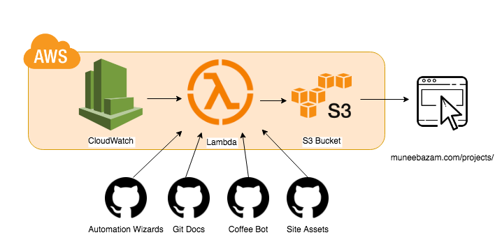

## Pipeline Architecture 

Under the hood, Git Docs is powered by AWS.

At its core it is a set of [AWS Lambda](https://aws.amazon.com/lambda/) functions which are configured (via [CloudWatch Events](https://docs.aws.amazon.com/AmazonCloudWatch/latest/events/WhatIsCloudWatchEvents.html)) to trigger periodically and publish any documentation changes to a hosted [S3 Bucket](https://aws.amazon.com/s3/). 

This architecture can be better visualized using the diagram below.

 

In chronological order the AWS services utilized are:

1. CloudWatch Events trigger our Lambda function 

2. Lambda function pulls in content from repositories

3. Lambda function builds static site using Hugo

4. Lambda function pushes generated content to S3

5. S3 is configured to host, making changes live immediately

